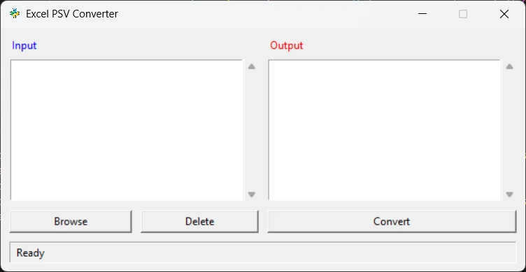

# Excel PSV Converter

A simple desktop application to convert Excel (.xlsx, .xls) and CSV files to pipe-separated values (PSV) format.

<p align="center">
  
</p>

## Features

- Convert multiple Excel and CSV files to PSV format in one operation
- Simple and intuitive user interface
- Batch processing capability
- Automatic output folder creation
- Status updates for each operation

## Screenshots

### Main Application Window

<p align="center">
    
</p>

### File Selection

<p align="center">
    
</p>

### Conversion Complete

<p align="center">
    
</p>

## Installation

1. Ensure you have Python 3.6+ installed on your system.
2. Install the required packages:
   ```
   pip install openpyxl pandas tkinter
   ```
3. Download the application files or clone the repository.
4. Run the application:
   ```
   python ExcelPSVConvertor.py
   ```

## Usage

1. **Launch the application** by running `ExcelPSVConvertor.py`.
2. **Select input files** by clicking the "Browse" button and selecting one or more Excel or CSV files.
3. **Review the selection** in the left panel. You can remove files from the selection using the "Delete" button after selecting them in the list.
4. **Convert files** by clicking the "Convert" button. Files will be converted and saved to an "Output" folder in the same directory as the input files.
5. **View results** in the right panel showing all successfully converted files.

## How It Works

The converter performs the following operations:
- Excel files (.xlsx, .xls) are read using the openpyxl library
- CSV files are read using Python's built-in csv module
- All data is written to new files using the pipe (|) character as the delimiter
- Output files retain the same name as input files but with a .csv extension

## Requirements

- Python 3.6+
- openpyxl (for Excel file processing)
- pandas (for data manipulation)
- tkinter (for the GUI components)

## Development

The application is structured with a class-based approach:

- `ExcelPsvConverter` class handles all application functionality
- GUI components are created in the `_create_widgets` method
- Layout is handled in the `_layout_widgets` method
- File conversion logic is in the `_convert_csv_to_psv` and `_convert_excel_to_psv` methods
